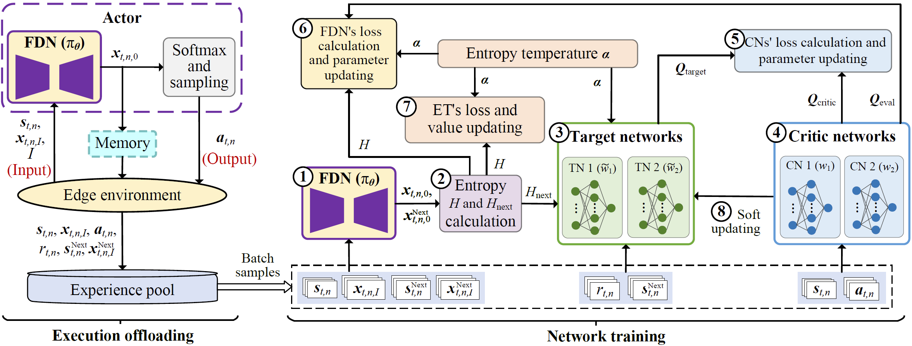
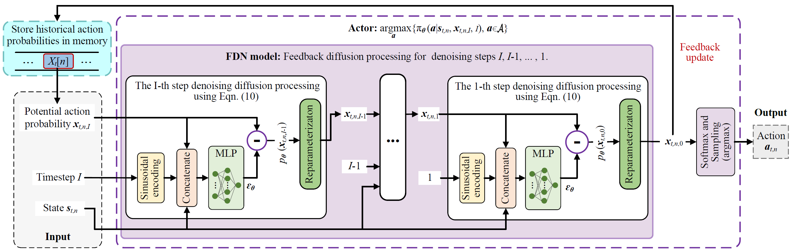
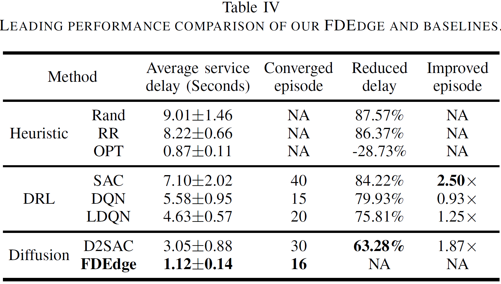

# FDEdge Implementation
This repo is an implementation of our paper "**Enhancing QoE in Collaborative Edge Systems with Feedback Diffusion Generative Scheduling**", **Accepted by IEEE Transactions on Mobile Computing**. In this repo, we implement the proposed FDEdge method and baselines in our paper.

## I. FDEdge Framework
we propose the FDEdge method by designing a feedback diffusion model-based DRL framework, which can generate better task-scheduling solutions with multi-step decision-making.
<div align=center>

</div>
The overall architecture of our FDEdge method, in which a Feedback Diffusion Network (FDN) model is designed and is used as the actor integrated into the basic SAC model. For each task arriving at the master node, the scheduler will offload it to a suitable ES for processing by the actor. The history data of task offloading is stored in an experienced pool. The FDN model is trained using the experience pool's history samples. The historical action probability $\boldsymbol{x}_{t,n}$ is recorded or updated in memory for feedback as the input of the diffusion process.

## II. Actor Structure
The actor structure is a multi-step decision-making process that is designed by an FDN model, a softmax unit, and a sampling unit.
<div align=center>

</div>
The actor structure with proposed FDN model. The actor input are the timestep $I$, potential action probability $\boldsymbol{x}_{t,n,I}$, and system state $\boldsymbol{s}_{t,n}$. The output is the action decision $\boldsymbol{a}_{t,n}$. The historical action probability $\boldsymbol{x}_{t,n,0}$ is stored (or updated) into the array $X_{t}[n]$.

## III. Comparison Performance 
<div align=center>

</div>
Our FDEdge method achieves the lowest delay, outperforming 87.57%, 86.37%, 84.22%, 79.93%, 75.81%, and 63.28% compared to the Rand, RR, SAC, DQN, LDQN, and D2SAC methods, respectively, and closely approximates the optimal method's delay. Moreover, our FDEdge converges at episode E = 16, demonstrating 2.50×, 1.25×, and 1.87× faster convergence than SAC, LDQN, and D2SAC, respectively.

## IV. FDEdge's Code implementation
The code of the FDEdge method mainly includes the following four files: 

- `feedback_diffusion.py`: This file implements the feedback diffusion processing.

- `edge_environment.py`: This file implements the collaborative edge computing environment that is initialized according to the given parameters in fdedge_main.py. 

- `fdsac_model.py`: This file implements the Mulit-Layer Perception (MLP) network, Actor, Target network, Critic network, and Network training processing.

- `fdedge_main.py`: This file implements the FDEdge algorithm's procedure. In this file, some key environment and model parameters are given. User can set by yourself. For instance, you can set the variable NUM_TASKS = 100 that represents the number of tasks arrived to the master node is in the range [1, 100] at a time slot t.

### Test Usage
User can run the `fdedge_main.py` to achieve the corresponding experimental results.
```sh
python3 fdedge_main.py
```

### Install
To run this code, please install some key packages: torch, NumPy, and matplotlib

## V. Baselines Implementation
In our paper, we use four baselines: Rand, DQN, SAC, D2SAC, and Opt.
The baselines are implemented in the Baselines directory.

(1) Rand baseline: Rand is a traditional heuristic method that randomly selects an ES to process for each task offloading. This method is a classic offloading solution often used as a comparison in edge computing studies.

(2) RR baseline: The Round Robin (RR) [1] method allocates tasks in cyclical order. This method generates favorable scheduling decisions when tasks are well-balanced, but it does not consider the significant differences among tasks.

(3) DQN baseline: The Deep Q-Network (DQN) [2] is a widely recognized DRL method that has been successfully applied in various domains. In our experiments, we faithfully implement the DQN method for task scheduling as a baseline, ensuring that it uses the same setup and configuration as our proposed method. User can run the `dqn_main.py` to achieve experimental results. 

(4) SAC baseline: The SAC [3] a state-of-the-art DRL algorithm known for its stability and efficiency in continuous action spaces. We implement SAC for task scheduling as another baseline, maintaining consistency in the experimental setup for a fair comparison. User can run the `sac_main.py` to achieve experimental results.

(5) LDQN baseline: This LDQN [4] method is based on the DQN model integrated with a Long Short-Term Memory (LSTM) network.  This code implementation can refer the [release code](https://github.com/ChangfuXu/Deep-Q-learning-for-mobile-edge-computing).

(6) D2SAC [5] baseline: D2SAC is the state-of-the-art scheduling method based on the diffusion model. This code implementation can refer the [release code](https://github.com/Lizonghang/AGOD).

(7) Opt baseline: The Opt method selects the best ES for each task by exhaustively evaluating all possible action combinations, representing an upper bound on task scheduling performance in our experiments. However, while it provides the theoretical best solution, it is impractical in real-world scenarios, as it requires prior knowledge of the available computing and network resources for each ES. User can run the `opt_main.py` to achieve experimental results.

### Install
To run this code, please install some key packages: torch, NumPy, and matplotlib

# References
[1] R. Beraldi and G. P. Mattia, “Power of random choices made efficient for fog computing,” IEEE Transactions on Cloud Computing, vol. 10, no. 2, pp. 1130–1141, 2022.

[2] V. Mnih, K. Kavukcuoglu, D. Silver, A. A. Rusu, J. Veness, M. G. Bellemare, A. Graves, M. Riedmiller, A. K. Fidjeland, G. Ostrovski et al., “Human-level control through deep reinforcement learning,” nature, vol. 518, no. 7540, pp. 529–533, 2015. [Code](https://github.com/LiSir-HIT/Reinforcement-Learning/tree/main/Model/1.%20DQN)

[3] T. Haarnoja, A. Zhou, P. Abbeel, and S. Levine, “Soft actor-critic: Off-policy maximum entropy deep reinforcement learning with a stochastic actor,” in Proceedings of the 35th International Conference on Machine Learning (PMLR), vol. 80. PMLR, 2018, pp. 1861–1870. [Code](https://github.com/LiSir-HIT/Reinforcement-Learning/tree/main/Model/8.%20SAC_Discrete)

[4] M. Tang and V. W. Wong, “Deep reinforcement learning for task offloading in mobile edge computing systems,” IEEE Transactions on Mobile Computing, vol. 21, no. 6, pp. 1985–1997, 2022. [code](https://github.com/ChangfuXu/Deep-Q-learning-for-mobile-edge-computing)

[5] H. Du, Z. Li, D. Niyato, J. Kang, Z. Xiong, H. Huang, and S. Mao, “Diffusion-based reinforcement learning for edge-enabled ai-generated content services,” IEEE Transactions on Mobile Computing, 2024. [Code](https://github.com/Lizonghang/AGOD)

# Citation
If our method can be used in your paper, please help cite:

@article{xu2025enhancing, title={Enhancing QoE in Collaborative Edge Systems with Feedback Diffusion Generative Scheduling}, author={Xu, Changfu and Guo, Jianxiong and Liang, Yuzhu and Zou, Haodong and Zeng, Jiandian and Dai, Haipeng and Jia, Weijia and Cao, Jiannong and Wang, Tian}, journal={IEEE Transactions on Mobile Computing}, year={2025}, publisher={IEEE}}

@article{xu2024dynamic, title={Dynamic Parallel Multi-Server Selection and Allocation in Collaborative Edge Computing}, author={Xu, Changfu and Guo, Jianxiong and Li, Yupeng and Zou, Haodong and Jia, Weijia and Wang, Tian}, journal={IEEE Transactions on Mobile Computing}, year={2024, doi: 10.1109/TMC.2024.3376550.}, publisher={IEEE}}

@inproceedings{xu2024enhancing, title={Enhancing AI-Generated Content Efficiency through Adaptive Multi-Edge Collaboration}, author={Xu, Changfu and Guo, Jianxiong and Zeng, Jiandian and Meng, Shengguang and Chu, Xiaowen and Cao, Jiannong and Wang, Tian}, booktitle={204 IEEE 44th International Conference on Distributed Computing Systems (ICDCS)}, pages={960-970}, year={2024}, publisher={IEEE}}
